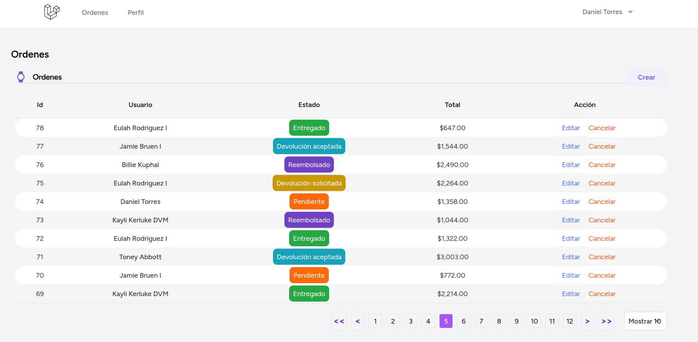
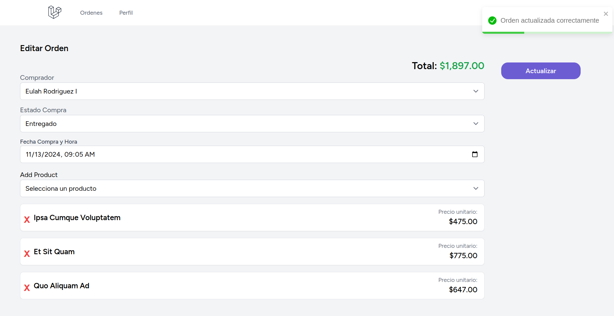

# Readme  

Project Order App 

# Images of Project



# Datasheet

Requirements | Value
------------ | -------------
Language | [PHP 8+.0](http://www.php.net)
Framework | [Laravel 11](https://laravel.com/docs/11.x)
Front Managed | [React 18](https://es.react.dev/)
Inertia JS | [Inertia](https://inertiajs.com)
Run time | [Node 21.5.5]

# Requirements
Php | [PHP 8+.0](http://www.php.net)
Composer | [PHP 2.7.7](https://getcomposer.org/)
Node | [Node 21.5.5]
Npm | yarn


# Setup

Instal Composer
```
composer install
```

Instal Node
```
yarn install or npm install
```

Create a key
```
php artisan key:generate
```

Duplicate .env and put the .env database
```
cp .env-template .env
```

Update values for db conection, for example
```
DB_CONNECTION=mysql
DB_HOST=127.0.0.1
DB_PORT=3306
DB_DATABASE=orderapp
DB_USERNAME=root
DB_PASSWORD=password
```

Execute the migrations on dev 
```
php artisan migrate:fresh --seed
```

<!-- optional execute php artisan migrate:fresh --seed just in dev. -->


Finally
In console at the same time run:
```
php artisan serve 
```

and
```
yarn run dev
```

Go to http://localhost:8000/


# Team
- Daniel Torres
- danieltorres1109


